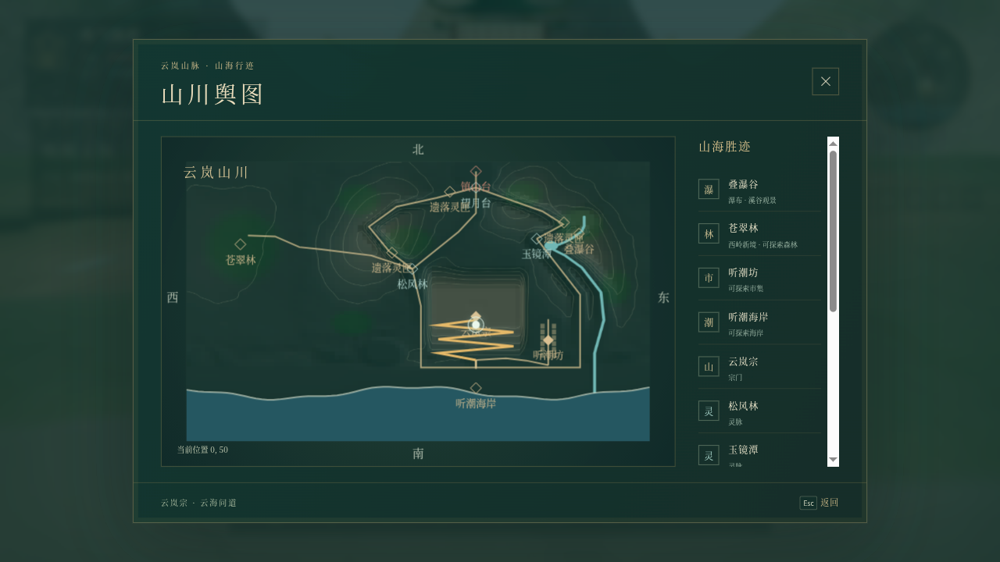

# 云海问道 · 山海仙境最终验收（2026-10-08）

第一阶段已完成：云岚宗位于约90米峰顶，山脚到庭院有约660米、五次折返的连续步行道路；松风林、望月台、玉镜潭接入山岭环线。东岭叠瀑谷有40米与13米两级动态瀑布，经玉镜潭与浅溪流入南部海湾。峰顶、林地、古镇与海岸在同一连贯世界；舆图、小地图和地点提示使用真实地形、水系和共享路线。

试玩：[本地预览](http://127.0.0.1:4194/)。WASD移动，右键转镜头，E交谈，M打开舆图。先接近峰顶师长，沿金色盘山路折返下山，从山脚向东到听潮坊、向南到听潮海岸；北侧环线串联三阵眼，东岭可看瀑布并沿浅溪涉水。解锁御剑后F升空，Space/C升降。旧存档沿用任务、物品和实体ID，地面位置会重新采样高度并避开实体。

| 已完成模块 | 本地提交 | 验证 |
| --- | --- | --- |
| 高山宗门与连续山路 | `c03170d` | 最终8项当前回归通过，含真实输入首章通关/重载、全程上山/峰顶续档、低空御剑、旧存档安全恢复、追敌归位和地形/林地；中心及左右2.5m最大纵坡0.476，低于0.55限。详见[模块记录](shanhai-map-20261008/module1-report.md)。 |
| 动态瀑布、玉镜潭与入海溪流 | `4b37a38` | 16个唯一相关检查最终通过，含真实浅溪全程/保存、55帧低飞越瀑、三阵眼环线、新版首章通关/重载/死亡重试及天气；独立review的接头与潭岸问题已修复。详见[水系记录](shanhai-map-20261008/water-report.md)。 |
| 大小地图首帧绘制 | `137d203` | CPU绘制地图底图，首帧/重开、实际键鼠、1024布局通过；构建通过。详见[修复记录](shanhai-map-20261008/map-raster-fix/README.md)。 |
| 当前完整画面基线与硬件归档 | `86ff632` | 65图更新43.819秒通过；随后独立比较与五项界面/存档/生产检查共六项77.255秒全通过，零失败/跳过/flaky。保持1.2%阈值、无遮罩。详见[最终记录](shanhai-map-20261008/final/README.md)。 |

水幕在约2.5秒内有55.95%区域像素发生可见变化，排除了人物；暂停与轻缓动效冻结，GPU资源数量前后稳定，零浏览器错误。[动态报告](shanhai-map-20261008/water/motion-report.json)与配对帧保留。新增水景共4几何、3材质，无新外部资产或生成服务依赖。

当前[manifest](evidence.json)声明11个1280×720 RTX4050场景，证据核验全部通过，原图已检查，浏览器错误0。峰顶306次绘制调用，比起始300预算高6次（2%）；其余10个场景预算内。全组最大610853三角、187几何、44纹理均在750000/300/60限内。这些静态负载不证明FPS。默认生产入口隐藏测试hooks，天气面板按此前需求保留。

生产构建通过，保留既有Vite大包提示。[82个运行/公开资源和33个生产产物指纹](shanhai-map-20261008/final/fingerprints.json)逐项匹配运行版本`137d203`。最终测试提交与说明提交没有修改运行源码。

早期硬件采集裁切错位、软件准备超时及旧天气断言失败如实保留在对应模块记录。图形环境恢复后重新采集完整65图并独立比较、重采11个硬件场景；当前结果取最后两份成功报告，不把早期失败或被人工拒绝的图当成验收。此前GPU采集异常的具体根因未确定。

云上群岛与幽境探险保留为后续路线图。当前保留首章、战斗、御剑、昼夜天气与存档，不新增交易系统或主线。逐模块中文提交及UTF-8核验见[制作记录](game-progress.md)。妖兽模型原[验收](creature-models-final-evidence-20261008.md)/[manifest](creature-models-evidence-20261008.json)、[太阳](sun-fivefold-final-evidence-20261008.md)、[月亮](emotive-moon-final-evidence-20261007.md)和其他历史证据独立归档。所有改动只在本地提交。
