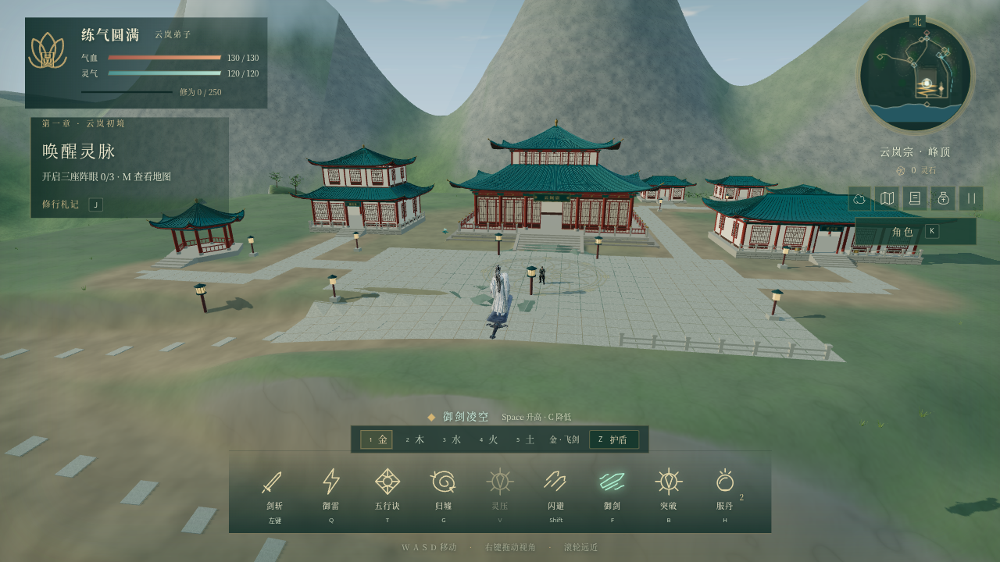

# 宗门建筑群扩建（2026-10-10）

已按宗门总览参考图，把七座新增建筑接入真实游戏世界。现有主殿模型、台阶及屋顶碰撞沿用原实现。整体布局以主殿为中心，藏经阁位于左侧，炼丹堂位于右侧，三座弟子居所在后方，六角观景亭位于左前方，山门横跨右侧上层盘山道。

## 已完成的建筑与工程

| 建筑 | 世界中心 X / Z | 特征 |
| --- | --- | --- |
| 藏经阁 | -28 / 8 | 双层楼阁、两层曲面青瓦、格窗、匾额、石栏 |
| 炼丹堂 | 31 / 14 | 五开间单层大堂、正门、石栏、门前小炉 |
| 西院居所 | 22 / -28 | 三开间、敞开入口、窗格、短阶 |
| 北院居所 | 38 / -30 | 同一建筑套件，独立台基与入口 |
| 东院居所 | 43 / -12 | 朝向西侧院路 |
| 观景亭 | -40 / 27 | 开放六角亭、六柱、栏杆、攒尖顶 |
| 云岚山门 | 25 / 61.3846 | 沿盘山道旋转，保留中央通行口 |

- 建筑有实体瓦垄、屋檐厚度与暗色檐底、朱柱、梁架、简化斗拱、格窗浮雕、石台基与入口台阶。七座模型共 **86,470 三角形**；相邻六座建筑按八种材质合批，山门保留六个绘制网格。详见 [模型统计](architecture-metrics.json)。
- 广场、连接道路、石灯及东侧石栏已加入；斜坡上的铺地采样各角实际地面，避免平铺方块悬空。后院通路的石灯已移至路外。
- 建筑脚高与每一级可见台阶共用尺寸；渲染地面与新台基分开采样，避免台基外形成埋脚的草坡。植被生成排除建筑及入口。
- 侧墙、背墙、门洞两侧、柱体和栏杆有身体碰撞；曲面屋顶由真实结构三角面生成三维代理，共 4,416 个薄板，加一个山门梁体。镜头使用每层屋顶的独立包围盒，避免两层屋顶之间的空域被整体盒体填满。
- HUD 可显示当前建筑名；新增测试视角继续受现有 DEV / `?test=1` 门控。

## 验证与复核

`npm run build` 已通过。最终宗门、现有主殿及地面套件 **12 项检查全部通过**（2.2 分钟）；盘山道完整真实输入检查单独通过（2.1 分钟）；另有两项道路坡度与保护带采样通过。合计 15 项不同检查。

真实输入覆盖：广场到后院、三个居所、观景亭、穿过山门、藏经阁及炼丹堂入口、背墙阻挡、室内保存和继续、御剑下降接触藏经阁屋顶及再次升起。山脚至主殿沿道路中心分段行走，经过各层折返，峰顶存档恢复后仍可接近师长。

```sh
npm run build
npx playwright test tests/sect-site.spec.ts --grep 'retain their visual layout' --update-snapshots
npx playwright test tests/sect-site.spec.ts tests/main-hall.spec.ts tests/terrain.spec.ts
npx playwright test tests/shanhai-map.spec.ts --grep 'real walking climbs'
npx playwright test tests/shanhai-map.spec.ts --grep 'graded walking slopes|summit forecourt'
node scripts/inspect-threejs-canvas.mjs --manifest artifacts/sect-expansion-20261010/evidence.json --headed --url 'http://127.0.0.1:4194/?test=1' --seed 42
python3 /home/ryan/.codex/skills/threejs-game-director/scripts/check_evidence.py . --manifest artifacts/sect-expansion-20261010/evidence.json
```

新建筑是需要保护的稳定场景，因此新增整体、藏经阁、山门三张截图基线。先生成基线，再在最终套件中做实际比较；阈值为 `maxDiffPixelRatio=.012`，固定种子 42、冻结模拟、关闭动态效果并等待字体。没有更新其他场景的历史基线。

独立只读 review 找到并修复：台基外草坡埋脚、观景亭入口与盘山路高度冲突、山门内部脚高受地形网格插值影响、两层屋顶镜头代理填满空域，以及石灯挡住后院通路。新增回归断言覆盖这些复现点。实机检查还将观景亭移离最后一段上山路线，放宽居所入口并修正测试中的存档恢复等待。

## 当前画面与证据

当前有效 runId：`sect-expansion-20261010-final-r2`。桌面 1280×720，RTX 4050 硬件渲染；九个视角非空白且无页面/控制台错误。图片已经人工检查，分别覆盖整体、藏经阁、炼丹堂、居所、亭、门、阁楼屋顶、原主殿及地面广场。



- [藏经阁](final-r2/library.png)、[炼丹堂](final-r2/alchemy.png)、[弟子居所](final-r2/residences.png)、[观景亭](final-r2/pavilion.png)、[山门](final-r2/gate.png)。
- [建筑内部输入与存档](interior-input.json)、[广场和居所路线](courtyard-input.json)、[屋顶升降输入](roof-input.json)、[完整上山路线](ascent-input.json)。
- [入口画面](input-library-inside.png)、[亭内画面](input-pavilion-inside.png)、[原主殿回归输入](main-hall-regression/entry-input.json)、[原主殿回归视角记录](main-hall-regression/views.json)。
- [捕获清单](evidence.json) 与 `final-r2/*.json` 保存各视角像素指标、实际 GPU 和资源统计。[改动前画面](before.png) 及 [改动前统计](before.json) 仅用于历史比较。

## 范围与资源取舍

这是参考图建筑群的程序建模与布局版本，建筑内家具、楼梯和功能玩法尚未增加。周围山体、植被与天气继续使用现有游戏环境；本模块仅适配建筑地基，不代表 AI 地形 GLB 工作流已经完成，也不宣称达到参考图的整体写实画质。

保留主殿细节及全部新增建筑。整体视角约 330 calls / 986,696 三角形，改动前记录为 333 / 916,920；不同近景随视锥裁剪变化。整体和部分视角超过检查器的桌面起点预算 300 calls / 750,000 三角形，几何和纹理数量在预算内。原场景已超过起点预算，新增模型已合批；这里记录画面复杂度的取舍，没有测量稳定帧率，也不作 60 FPS 或低端设备性能承诺。

代码与最终证据作为一个扩建模块本地提交，提交标识记录于 `artifacts/game-progress.md`；未 push。已有女性角色预览、Vite 配置及 AI 地形流程工作未混入本模块。
