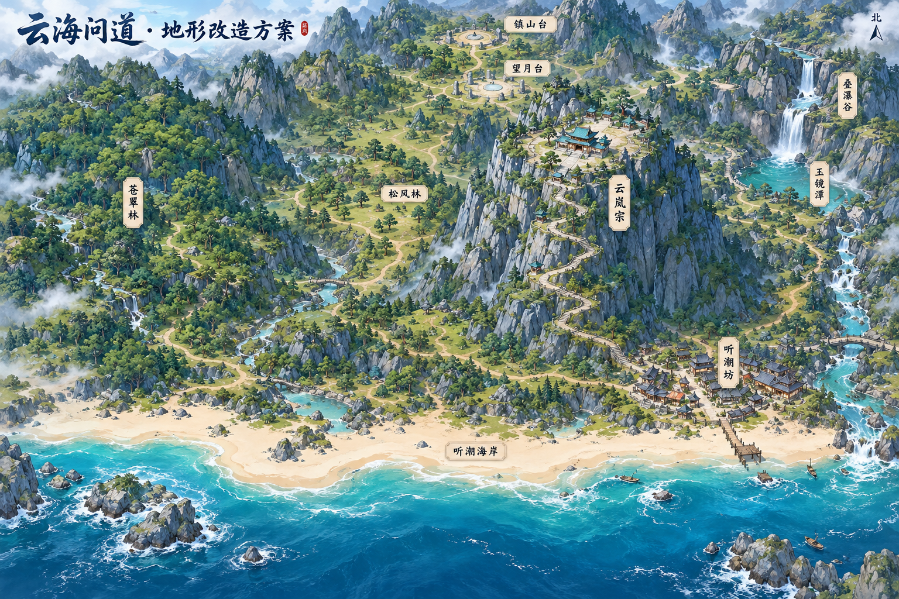

# 地图 v1 · 待用户审批

该图由内置 image_gen 按 [完整提示词](prompt.txt) 生成，用于整体地图布局和地形美术方向审批。尚未获得用户批准，未向 Meshy 提交模型任务，未替换游戏地形。

## 本轮审批内容

- 峰顶宗门的大平台、主要岩壁形态与连续上山道路。
- 西侧森林与山谷、北侧低谷试炼场和周围山脊。
- 东侧叠瀑谷、玉镜潭与下游至海岸的主水系。
- 东南小镇的平地预留，以及南侧沙滩、礁石与河口。
- 青灰岩、自然风化、苔藓与森林的整体美术方向。

图中建筑作为占地与美术示意，实际建筑继续用 Three.js 建模。局部亭桥、小溪与细节属于概念表现，不等于新增任务或已经确定的工程几何；精确点位仍由项目布局和经批准的修改确定。该总览图不能直接作为整个地图的 Meshy 单图输入。

通过该图后，AI 先生成宗门山顶、主体山体和山脚的独立建模图，按批送用户审批。该批批准后，才执行对应图片的 Meshy Image to 3D、GLB 检查优化、拼接和实机验收；无需额外的模型或代码审批。

[图像检查记录](review.json) 保存源路径、SHA-256、PNG 完整性和实际审图记录；[工作流](../../../../docs/ai-terrain-workflow.md) 与 [活跃计划](../../plan.json) 管理后续阶段。原始生成图片仍保留在工具返回的默认位置。
